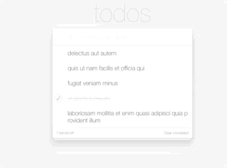

# Assessment: {Assessment Name Here}

For this assessment, you'll be creating {what they'll be creating here}:



In doing so, you'll be demonstrating a basic understanding of the following:

- some learning objectives
- should go here
- that motivate this assessment

## Getting Started
To get started, _fork_ this repository into your own GitHub account then clone
this repository to your local machine:

```console
foo@bar:~ $ git clone git@github.com:github-username/{repo name}
foo@bar:~ $ cd {repo name}
foo@bar:~/{repo name} $
```

Note `github-username` above. In other words, __don't__ simply copy-paste the
code above blindly into a terminal. 

Next, you'll need to install dependencies using `yarn`:

```console
foo@bar:~/{repo name} $ yarn
```

Before coding, you should ensure that this scaffold works by running the application:
```console
foo@bar:~/{repo name} $ yarn start
```

## Acceptance Criteria

### Step 1: { Task description } (x point(s))
{ Describe the task to be completed }


## Bonus (0 points)

If you find yourself with extra time (e.g., don't have other assessments to
catch up on), you may consider improving the quality in a number of ways:

- { some extra work that can be done to challenge the student further }

## Submission

This morning, you learned how to deploy a React app to GitHub Pages, so you
__will__ be required to submit a deployed application today. If you instead
submit a link to a GitHub repository (that is, only code), you _will_ be awarded
__0__ points.
